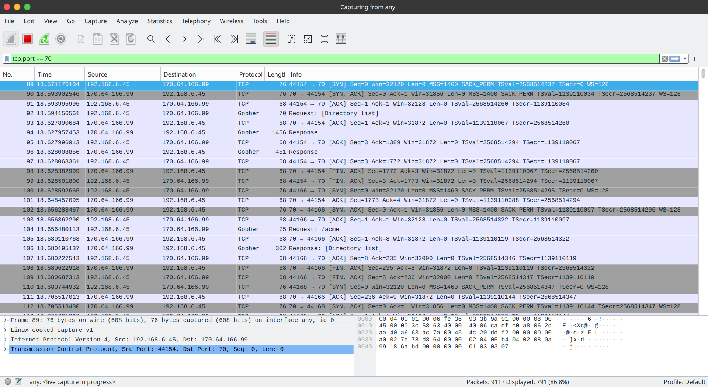

# Gopher Indexing Client

This Internet Gopher client written in the C programming language indexes
directories and files. It is implemented in accordance with
[RFC 1436](https://www.rfc-editor.org/rfc/rfc1436). The overall design is to
ensure that outbound requests strictly adhere to the protocol standard whilst
handling inbound responses as gracefully as possible.

## Initialisation

The program is intended for Linux machines with GCC installed. The standard
C library is sufficient for compilation. Use the command `make` to compile the
program with the [source code](client.c). Simply execute the command
`./client <hostname> <port>` to run the program. For example,
if the Gopher server is hosted locally at port 70, `./client localhost 70`
connects to it. An IP address can also be directly used. As an example, the
command `./client 127.0.0.1 70` is also valid.

For local testing, a local Gopher server can be started using
[Motsognir](https://github.com/unisx/motsognir) with the command
`sudo motsognir`. The listening port and the process can be listed using the
command `sudo lsof -i :70`.

## Program Design

The overall design relies on performing a breadth-first search (BFS) of the
filesystem hosted on the Gopher server. The indexed files and directories are
recorded in a linked list implemented using the `entry` struct. Each `entry`
contains the type of the record (`item_type`), the record itself (`record`).
The pointer `next` directs to the next entry in the linked list.

There are six types of records.

Entry type (`item_type`) | Record (`record`)
-------------------------|----------------
`DIRECTORY`              | Pathname to the directory
`TEXT`                   | Pathname to the text file
`BINARY`                 | Pathname to the binary file
`ERROR`                  | Invalid request line
`EXTERNAL`               | Request line referencing an external server
`TIMEOUT`                | Pathname to the file taking excessive time to download
`TOO_LARGE`              | Pathname to the file exceeding the size limit

Since the protocol is stateless and the connection is terminated once the server
has responded, the function `gopher_connect()` establishes and closes a
connection every time a new request is made. The function `gopher_connect()`
appends `\r\n` to the request which is passed as the parameter
`request`. It sends the request line to the server. The function `func()`,
passed as another argument to `gopher_connect()`, is responsible for receiving
the response from the server.

Instantiations of `func()` include `indexing()`, `evaluate_file_size()` and
`print_response()`. With reference to the protocol guidelines, the client
listens for a response until the server terminates the connection. Therefore,
these three functions use `recv()` provided by the Socket API in a while loop.
The built-in `timeval` struct and the `errno` library in C are utilised for
handling timeouts and failed responses. Notice that a failure to receive a
response is handled differently from an empty string response from the server.

### Recording Indexed Files and Directories

As long as the server adheres to the protocol's format, its response to a
pathname is always the directory index with the first character of a row
indicating the nature of the file. For instance, `0` indicates that the file
is a (non-binary) text file whereas `1` refers to a subdirectory or an external
server. The function `indexing()` uses this information to determine the type
of the file/directory. A new entry is added to the linked list, including the
item's pathname and type.

If the request is invalid, the corresponding response begins with `3`. In this
case, a new entry is added to the linked list if and only if it does not already
exist. This enables us to count the number of invalid references at a later
stage.

With reference to RFC 1436, the canonical type `9` refers to binary files.
Actual server implementations often have more specific types and non-canonical
types that gained popularity after RFC 1436 was published.
In this client program, files that are not in plain text are considered binary.

**Classification**           | **File types**
-----------------------------|------------
Directory                    | `1`
Reference to external server | `1`
Text file                    | `0`
Binary file                  | `4` (BinHex-encoded file), `5` (DOS file), `6` (uuencoded file), `9` (Binary file), `g` (GIF), `I` (Image), `:` (Bitmap), `;` (Movie), `<` (Audio), `d` (Document), `h` (HTML), `p` (PNG), `r` (RTF), `s` (Sound), `P` (PDF), `X` (XML)
Error                        | `3`

Any row in the response starting with the character `i` is a human-readable
informational message, thus ignored by the indexation process. Other references
such as Telnet (`8` and `T`), CCSO nameserver (`2`) and mirror (`+`) do not fall
within any of the categories above. These types are therefore disregarded by
the indexation process.

### Recursively Index Subdirectories

Following the indexation of the root directory using the request `\r\n`,
`main()` goes through the linked list and calls `gopher_connect()` for every
subdirectory. This effectively models a breadth-first search of the filesystem
hosted on the Gopher server.

### Evaluation and Loading of File Content

Upon indexation of all directories and files in the filesystem, `evaluate()` is
called to find the following information:
1. Number of directories, text files and binary files
2. Content of the smallest text file (if multiple exist, the first one indexed)
3. Sizes of the smallest and the largest text files
4. Sizes of the smallest and the largest binary files
5. Number of invalid references (each unique invalid request is counted once)
6. List of external server references (hostname and port) and their connectivity
7. List of references causing issues/errors

The helper function `test_external_servers()` checks the connectivity to
external servers by attempting to establish a connection. A server is
considered "up" if it accepts the connection in a few seconds. Otherwise, it is
marked as "down".

### Terminal Output

As the client program runs, logs are printed to the terminal (`stdout` and
`stderr`). The terminal outputs to `stdout` are in the following formats.
- `Request sent at <timestamp>: <request>`
- `Indexed <item type>: <pathname of newly indexed item>`
- `Number of <directories/text files/binary files/invalid references>: <number>`
- `Size of the <smallest/largest text/binary file>: <number>`
- Other information produced by `evaluate()`

Issues and errors are printed to the terminal through `stderr`:
- `Usage: <program name> <hostname> <port>`
- `Error: <error message>`
- `File too large: <pathname>`
- `Transmission timeout: <pathname>`

### Minimising Errors and Maximising Security

Whilst this client program follows the Gopher protocol standard in RFC 1436,
measures are taken to reduce the impact of malformed responses from servers.
For instance, the response is written to a string variable
and is always explicitly terminated with the null terminator (`\0`). This
avoids problems such as out-of-bound reading/writing.

Safer built-in functions in C (such as `strncpy()` rather than `strcpy()`) are
used to avoid unexpected behaviour that might possibly be the result of long
requests or responses. Indexed records in the linked list, with memory allocated
using `malloc()`, are cleaned up by `cleanup()` before `main()` terminates.

At the beginning of `gopher_connect()`, the program is terminated if the
connection cannot be established. An error message is printed to `stderr`
specifying the issue.

### Handling Empty Responses and Timeouts

A correctly implemented server should respond with some content under all
circumstances. "Empty response from the server" is printed to the terminal if
the server terminates the connection without any response. This clarifies to the
user whether the connection is terminated or the client is still waiting for a
response.

Servers may be busy or unresponsive at times. There are two types of timeouts.
1. The server accepts the connection but does not respond to a request.
2. The server accepts the connection and responds but it takes too much time.
3. The server does not accept the connection within the time limit.

Timeouts prevent the program from getting stuck indefinitely.
The first situation is managed using `setsockopt()`, a built-in feature in the
Socket API, and the `timeval` struct. The configuration is set by
`gopher_connect()`. The limit is currently set as 10 seconds.

The second situation is handled using `select()` and `fcntl()`. The
configuration is set by the function responsible for receiving the response.
The limit is currently defined as 5 seconds.

The third situation applies in `test_external_servers()` with a 5-second limit.

### Handling Edge Cases: Malformed or Non-Standard Responses

A well-implemented server's directory index response should include four pieces
of information, separated by tab characters. In case a line therein is
malformed, the program handles it gracefully to avoid indexing invalid things.
It is also designed to handle long responses from the server.

Motsognir, for example, ensures that every line including errors and
informational messages includes three tab characters as separators.
```
3error fake fake 0
iInformational fake fake 0
```
Other servers format these responses differently. The class server, for
instance, uses `invalid` rather than `fake`.
```
3error invalid 0
iInformation invalid 0
```
The client program ensures correct handling of responses when interacting with
different servers.

A server's response should end with a line containing `.\r\n` followed by the
null terminator. However, if the server does not follow the standard protocol
to the full extent and terminates transmission without `.\r\n`, the program
still handles the response gracefully. The client program perceives a server's
termination of the connection as the end of data transmission. An example is
`/misc/malformed2` on the class server.

Unicode was not published at the time the Gopher protocol was publicised.
We assume that pathnames contain only ASCII characters, or else converted into
ASCII representations on the server side (as it is in Motsognir). For example,
a file named "ɡoʊfər" is detected as "%C9%A1o%CA%8Af%C9%99r".

Some malformed responses omit the hostname and the port in an entry of the
directory index. Examples include `/misc/malformed1`. This client still attempts
to index the file, assuming it exists on the server. If the file does
not exist in the server, the pathname is regarded as an invalid reference.

### Handling Edge Cases: Exceptionally Large Files

As part of the `evaluate()` function's execution, the client has to download
the files for analysis of their properties, such as their size. The files may
sometimes be unexpectedly large. The global constant `FILE_LIMIT` specifies the
maximum file size that the client may accept. This ensures that the client will
not be flooded with infinite/unacceptable network traffic, of which malicious
parties may take advantage. Files exceeding the size limit are not considered
in the statistics (*e.g.*, sizes of largest files) evaluated by `evaluate()`.

Currently, `FILE_LIMIT` is set as 65536 bytes, considering that most files on
`comp3310.ddns.net` do not exceed this limit. In realistic situations, users
of this client should know the size scale of files that the target server
hosts. This global constant can be adjusted accordingly. Files exceeding the
file limit are logged and printed before the client program execution ends.

## Testing

The client program is tested with the class server and a local Motsognir server.
The terminal outputs are included for reference:
- [Example log 1](assets/output1.txt) with a file size limit of 65536 bytes
- [Example log 2](assets/output2.txt) with no file size limit

Wireshark is used for monitoring the network traffic. The initial request is
detected as "Request: [Directory List]". There are occasional retransmissions
of TCP packets and spurious acknowledgement (ACK) signals.



## References

1. Anklesaria et al. (March 1993). RFC 1436: The Internet Gopher Protocol.
   *The RFC Series*. https://www.rfc-editor.org/rfc/rfc1436
2. Arkaitz Jimenez. (September 2009). Time stamp in the C programming language.
   *Stack Overflow*. https://stackoverflow.com/a/1444440
3. Basile Starynkevitch. (September 2015). How to use `select()` on sockets
   properly?. *Stack Overflow*.
   https://stackoverflow.com/a/32711642
4. caf. (April 2010). C: socket connection timeout. *Stack Overflow*.
   https://stackoverflow.com/a/2597774
5. dgookin. (July 2020). The `gettimeofday()` Function. *C For Dummies Blog*.
   https://c-for-dummies.com/blog/?p=4236
6. Frédéric Hamidi. (October 2010). What does `EAGAIN` mean?. *Stack Overflow*.
   https://stackoverflow.com/a/4058377
7. Foobar. (Oct 2018). Client in C++, use `gethostbyname` or `getaddrinfo`.
   *Stack Overflow*. https://stackoverflow.com/q/52727565
8. IEEE and The Open Group. (2003). `setsockopt`. *Linux man page*.
   https://linux.die.net/man/3/setsockopt
9.  Milan. (Mar 2011). How to convert string to IP address and vice versa.
   *Stack Overflow*. https://stackoverflow.com/a/5328184
10. Tomek Szpakowicz. (December 2009). When to use static keyword before global
    variables?. *Stack Overflow*.
    https://stackoverflow.com/a/1856642
11. Wikipedia contributors. Gopher (protocol). *Wikipedia*.
    https://en.wikipedia.org/wiki/Gopher_(protocol)

Last update: 2024-04-08
